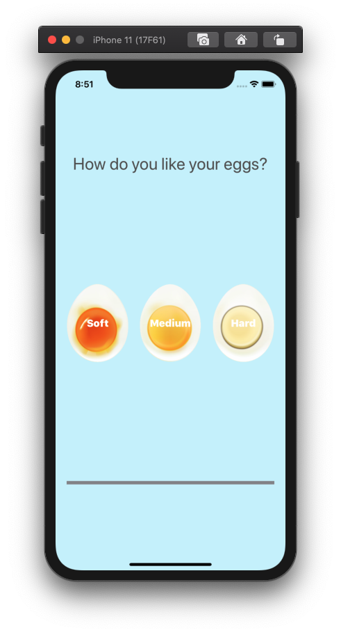
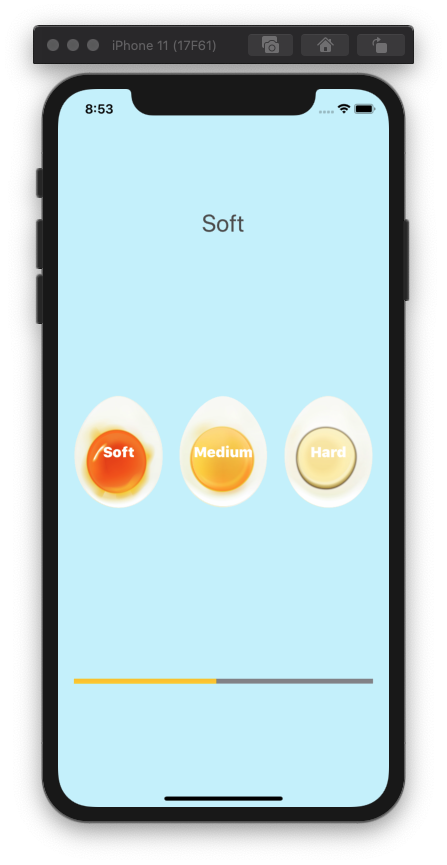
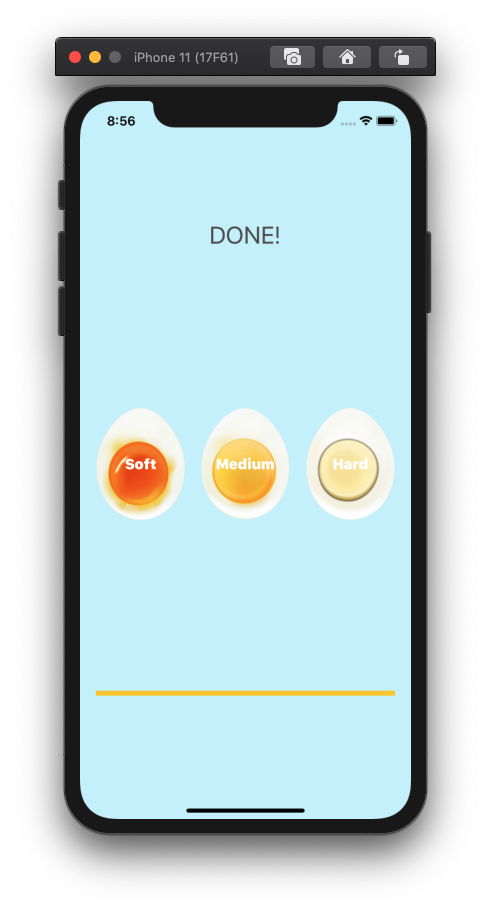

# EggTimer

## Goal

> 1. 달걀의 삶는 정도에 따라 Soft, Medium, Hard로 분류
> * Soft : 300s
> * Medium : 420s
> * Hard : 720s
> 2. 임의의 버튼을 누르면 해당 시간에 맞게 ProgressBar가 진행됨
> 3. 시간이 종료되면 Label에 DONE! 이 출력되면서 alarm_sound.mp3 재생

## 실행 화면

### 세로 모드

### 진행 중

### 시간 종료

